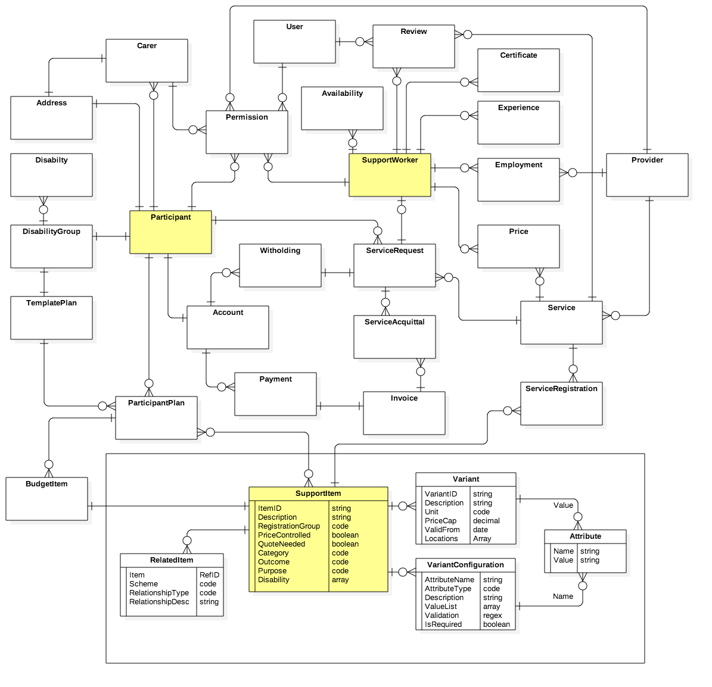

## Logical Data Model



## Denormalised JSON models

### Support Items

Examples of home assistance with variants by period and intensity.  Locations are postcode regex expressions indicating any location in NSW, VIC or QLD

```
{"SupportItem":{
   "ItemID":"104",
   "Description":"Assisting with, and/or supervising, personal tasks of daily life to develop skills of the participant to live as autonomously as possible.",
   "RegistrationGroup":"Personal Activities High",
   "PriceControlled":True,
   "QuoteNeeded":False,
   "Category":"Assistance with daily life (includes Supported Independent Living)",
   "Outcome":"Daily Living",
   "Purpose":"Core",
   "Variants":[{
      "VariantID":"01_005_0104_1_1",
      "Unit":"hour",
      "PriceCap":97.68,
      "ValidFrom":"2016-07-01",
      "Locations":["2...","3...","4..."],
      "Attributes":{
         "Period":"Public Holidays",
         "Intensity":"High"}
      },
      {
      "VariantID":"01_006_0104_1_1",
      "Unit":"hour",
      "PriceCap":62.66,
      "ValidFrom":"2016-07-01",
      "Locations":["2...","3...","4..."],
      "Attributes":{
         "Period":"Saturdays",
         "Intensity":"High"}
   }
}
```

Examples of shared accomodation assistance with variants by number of sharers and level of need.  Locations are postcode regex expressions indicating any locations in the Sydney area

```
{"SupportItem":{
   "itemID":"115",
   "Description":"Assistance in a shared living arrangement",
   "RegistrationGroup":"Daily Tasks/Shared Living",
   "PriceControlled":True,
   "QuoteNeeded":False,
   "Category":"Assistance with daily life (includes Supported Independent Living)",
   "Outcome":"Daily Living",
   "Purpose":"Core",
   "Variants":[{
      "VariantID":"01_028_0115_1_1",
      "Unit":"week",
      "PriceCap":4807.14,
      "ValidFrom":"2016-07-01",
      "Locations":["20..","21.."],
      "Attributes":{
         "Persons":2,
         "Needs":"Complex"}
      },
      {
      "VariantID":"01_036_0115_1_1",
      "Unit":"hour",
      "PriceCap":2374.71,
      "ValidFrom":"2016-07-01",
      "Locations":["20..","21.."],
      "Attributes":{
         "Persons":"4",
         "Needs":"Standard"}
   }
}
```
Examples of non priced quotable items (wheelchairs) with variants by type, size, and customisation.  Locations regex mathces any postcode - meaning the variant item is not location sensitive.

```
{"SupportItem":{
   "itemID":"115",
   "Description":"Manual wheelchair",
   "RegistrationGroup":"Personal Mobility Equipment",
   "PriceControlled":False,
   "QuoteNeeded":True,
   "Category":"Assistive technology",
   "Outcome":"Daily Living",
   "Purpose":"Capital",
   "Variants":[{
      "VariantID":"05_122203108_0105_1_2",
      "Unit":"each",
      "ValidFrom":"2016-07-01",
      "Locations":["...."],
      "Attributes":{
         "Custom":True,
         "Type":"Folding",
         "Size":"Adult"}
      },
      {
      "VariantID":"05_122203114_0105_1_2",
      "Unit":"each",
      "ValidFrom":"2016-07-01",
      "Locations":["...."],
      "Attributes":{
         "Custom":True,
         "Type":"Rigid",
         "Size":"Child"}
   }
}
```
