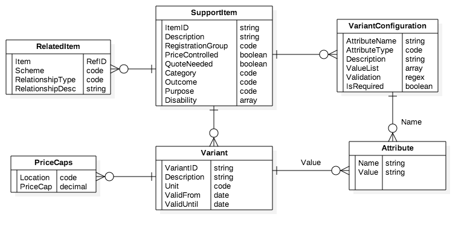

## Support Items Catalog Issues & Requirements

The current support item lists at https://www.ndis.gov.au/providers/pricing-and-payment.html
* Are distributed across 4 spreadsheets, each containing about 600 items.   So around 2400 discrete line items.
* Have a lot of very similar items that arent really different supports, they are just different drivers for variable price caps.  
* Are very hard to navigate and understand, even for provider - never mind participants.

I think that a better model for the support item list looks like this:
* Collapse all lines that are really the same thing into a single support item (eg a wheelchair) with any number of "variants" that can have different attributes and price caps.
* Allow for the attributes that drive the variants to be configurable by support item (for example home care variants depend on location, day of the week, level of care - whilst wheelchair variants depend on size, type, power source, etc)
* Allow for support items to be related to other support items - possibly from different schemes (eg aged care, child care, veterans affairs).
* In order to facilitate easy migration from current to future state, we should attach the current support item ID (eg "05_122203108_0105_1_2" for a customised adult folding wheelchair) to the variant. 

The ERD is shown below. Key entities are SupportItem, Related Item, VariantConfiguration, Variant, Attribute.



This will mean that the to-be catalog will
* Reduce the number of support items from about 2400 to about 100 - making it much easier to navigate for the "what supports can I have?" use case
* Define variant attributes by support item type so that it's easy to drill down to find out "what kind of wheelchairs can I have?" once you've found the wheelchair item.
* Have (initially) the same number of "variants" as the current catalog - making migration and mapping easy. 

The next piece of work is to actually do the transformation of the current 2400 items into about 100 items with variants and put a simple navigation tool over it.  That is the purpose of this specification.

## Source Data and Mapping

please refer to this [support item spreadsheet](docs/201617-VIC-NSW-QLD-TAS-Price-Guide-New%20structure.csv).  it is a modified version of the public ones - basically the old support items are now "variants" and there is a new, less granular, "support item" column.   To populate the new support item database:
* Start with this sheet to create the new support items and vairants.  
* Then use the other three sheets at https://www.ndis.gov.au/providers/pricing-and-payment.html to add extra variants to the existing items (basically these are just different price caps for different locations)

## Support Items Examples - Target state

Examples of home assistance with variants by period and intensity.  Locations are postcode regex expressions indicating any location in NSW, VIC or QLD

```
{"SupportItem":{
   "ItemID":"104",
   "Description":"Assisting with, and/or supervising, personal tasks of daily life to develop skills of the participant to live as autonomously as possible.",
   "RegistrationGroup":"Personal Activities High",
   "PriceControlled":True,
   "QuoteNeeded":False,
   "Category":"Assistance with daily life (includes Supported Independent Living)",
   "Outcome":"Daily Living",
   "Purpose":"Core",
   "Variants":[{
      "VariantID":"01_005_0104_1_1",
      "Unit":"hour",
      "PriceCaps":[{
          "Locations":{"NSW", "VIC", "TAS", "QLD"},
          "PriceCap":97.68},
          {
          "Locations":{"WA", "SA", "ACT", "NT"},
          "PriceCap":101.28},
          {
          "Locations":{"Remote"},
          "PriceCap":122.38}],
      "ValidFrom":"2016-07-01",
      "ValidUntil":"2017-06-30"
      "Attributes":{
         "Period":"Public Holidays",
         "Intensity":"High"}
      },
      {
      "VariantID":"01_006_0104_1_1",
      "Unit":"hour",
      "PriceCaps":[{ .. similar to previosu vairant ..}],
      "ValidFrom":"2016-07-01",
      "ValidUntil:"2017-06-30"
      "Attributes":{
         "Period":"Saturdays",
         "Intensity":"High"}
   }
}

```

Examples of non priced quotable items (wheelchairs) with variants by type, size, and customisation.  Locations regex mathces any postcode - meaning the variant item is not location sensitive.

```
{"SupportItem":{
   "itemID":"115",
   "Description":"Manual wheelchair",
   "RegistrationGroup":"Personal Mobility Equipment",
   "PriceControlled":False,
   "QuoteNeeded":True,
   "Category":"Assistive technology",
   "Outcome":"Daily Living",
   "Purpose":"Capital",
   "Variants":[{
      "VariantID":"05_122203108_0105_1_2",
      "Unit":"each",
      "ValidFrom":"2016-07-01",
      "ValidUntil":"2017-06-30",
      "Attributes":{
         "Custom":True,
         "Type":"Folding",
         "Size":"Adult"}
      },
      {
      "VariantID":"05_122203114_0105_1_2",
      "Unit":"each",
      "ValidFrom":"2016-07-01",
      "ValidUntil":"2017-06-30",
      "Attributes":{
         "Custom":True,
         "Type":"Rigid",
         "Size":"Child"}
   }
}
```

## Vairant configuration examples

```
{"VariantConfiguration":[{
   "AttributeName":"Custom",
   "AttributeType":"boolean",
   "Description":"Indicates whether the wheelchair is a stock item or is specifically customised for the disabled person",
   "IsRequired":"true"},
   {
   "AttributeName":"Size",
   "AttributeType":"code",
   "Description":"Indicates whether the wheelchair is for a child or an adult",
   "ValueList":["Adult", "Child"],
   "IsRequired":"true"}]
}
```

# UI Mockups

Please refer to [UI Design Pages](UIDesign.md)
